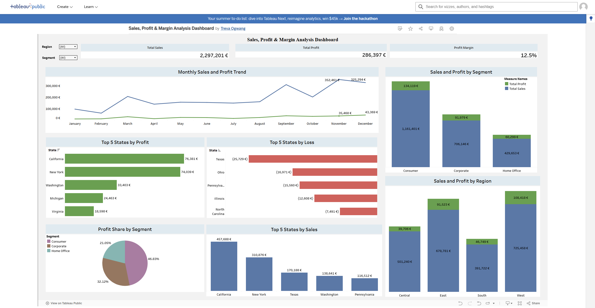

# 📊 Business Intelligence Dashboard (dbt + Tableau)

## Overview  
This project demonstrates an end-to-end **Business Intelligence workflow** using **dbt** for data modeling and **Tableau** for dashboarding.  
The dataset is the classic **Superstore dataset**, cleaned and transformed before creating insights in Tableau.  

## Data Transformation (dbt)  
- Connected **Superstore dataset** to dbt using SQLite.  
- Built **raw models** (importing raw orders).  
- Created **cleaned models** (renamed columns, handled duplicates).  
- Exported a summary dataset for visualization.  

## Dashboard (Tableau)  
Key Insights:  
- **KPIs:** Total Sales, Profit, Profit Margin %  
- **Trends:** Monthly Sales & Profit over time  
- **Comparisons:** Sales & Profit by Segment and Region  
- **Top Performers:** Top 5 States by Profit, Loss, and Sales  
- **Profit Share:** by Segment (Pie Chart)  

## Tech Stack  
- **dbt (SQLite)** – Data modeling and transformation  
- **Python** – CSV to SQLite loading script  
- **Tableau** – Dashboard design and visualization  

